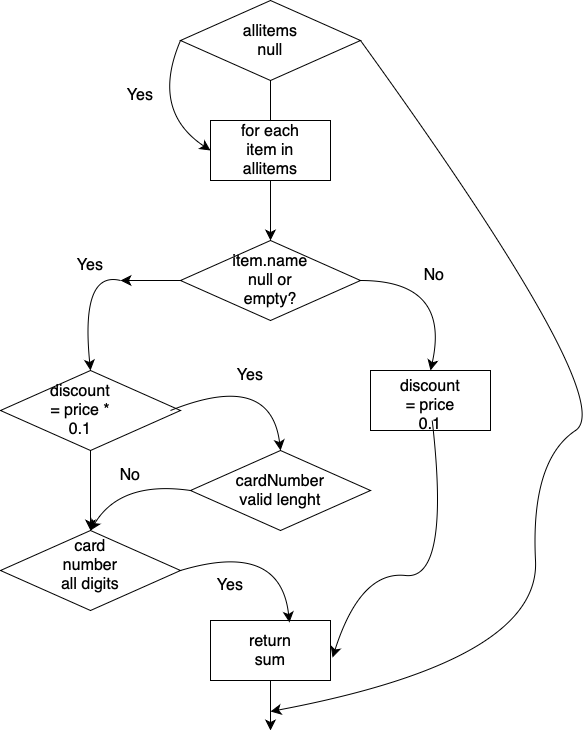

# SI2025_lab2_233283

1. Control Flow Graph

2. Цикломатска комплексност
Цикломатската комплексност на овој код е 7, истата ја добив преку формулата P+1 или M = E − N + 2
, каде што P е бројот на предикатни јазли. Во случајoв P=6, па цикломатската комплексност изнесува 7.

3. Тест случаи според критериумот Every statement

Овој критериум бара секоја линија од кодот да биде извршена барем еднаш. За ова беа креирани 3 тест случаи кои заедно ја покриваат целата функција.
Потребни ни се 3 тест случаи, `null`, 1 артикал со `null` име, валиден артикл со попуст и картичка 

3.1 Тест случаи според критериумот Every path

Овој критериум се однесува на if (item.getPrice() > 300 || item.getDiscount() > 0 || item.getQuantity() > 10), каде имаме 3 логички услови, па треба 2³ = 8 тест случаи за сите комбинации.

